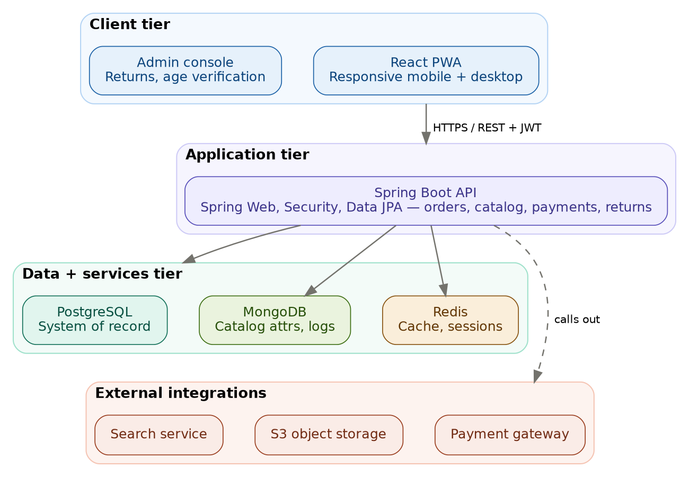
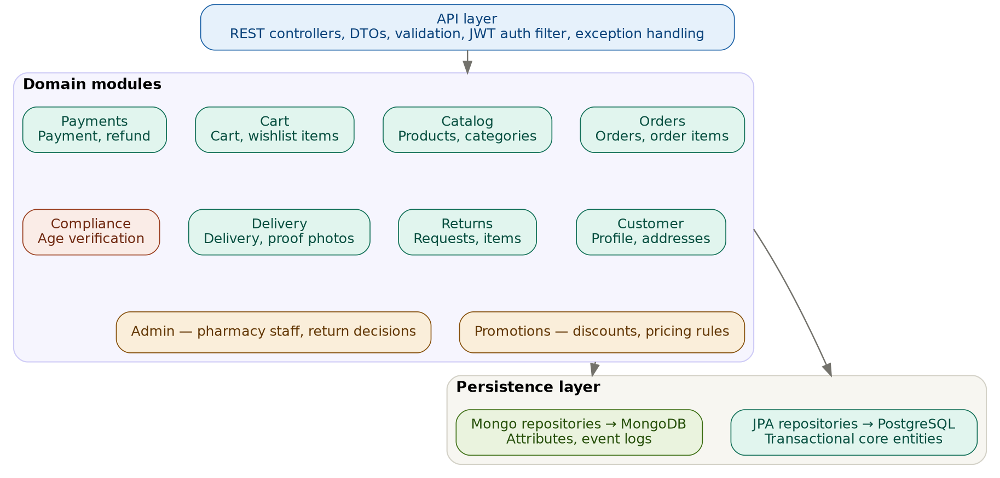
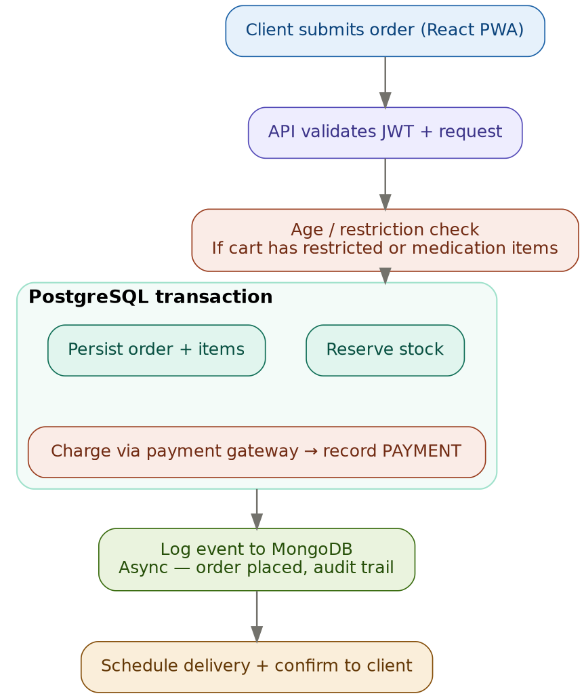

# Pharmos v1 — Architecture

Adaptive web app (mobile phone + computer) for a pharmacy e-commerce domain. This document describes the system architecture, module structure, data strategy, and the key decisions behind them. It sits alongside `techStack.md`.

## 1. Architectural Style

**Modular monolith.** For v1, the backend is a single deployable Spring Boot application whose internal packages map to bounded contexts from the domain model. This gives clean module boundaries now, with the option to extract any module into its own service later — without paying the distributed-systems tax (network hops, distributed transactions, service discovery) while v1 is still being validated.

**Layered inside the monolith:**
- API layer — REST controllers, DTOs, request validation, JWT auth filter, exception handling
- Domain modules — business logic, one package per bounded context
- Persistence layer — JPA repositories (PostgreSQL) and Mongo repositories (MongoDB)

## 2. Tiers

| Tier | Components |
|---|---|
| Client | React PWA (responsive storefront for mobile + desktop), admin console (returns, age-verification decisions) |
| Application | Spring Boot API — Spring Web, Spring Security, Spring Data JPA |
| Data + services | PostgreSQL (system of record), MongoDB (catalog attributes, event logs), Redis (cache, sessions) |
| External integrations | Payment gateway (Stripe/Braintree), S3 object storage (proof photos, product images), search service (OpenSearch/MeiliSearch) |

Clients talk to the API over HTTPS/REST with JWT auth. The backend calls out to payment, storage, and search, and results flow back through the API to the client.

## 3. Backend Module Structure

Each module owns a slice of the ERD:

| Module | Owns (ERD entities) |
|---|---|
| Catalog | Product, Category |
| Cart | Cart, Cart_Item, Wishlist_Item |
| Orders | Cust_Order, Order_Item |
| Payments | Payment, Refund |
| Returns | Return_Request, Return_Item |
| Delivery | Delivery, Proof_Photo |
| Customer | Customer, Address, Payment_Method |
| Compliance | Age_Verification |
| Admin | Pharmacy_Admin, return decisions |
| Promotions | Discount, pricing rules |

Modules communicate through their public service interfaces, not by reaching into each other's repositories. This keeps boundaries enforceable and makes future extraction into services mechanical rather than surgical.

## 4. Data Strategy

### PostgreSQL — system of record
Holds all transactional core entities: customers, orders, order items, payments, refunds, returns, delivery, age verification. Chosen over MySQL for native UUID and JSON/JSONB support and a stronger query planner for the complex joins this domain requires. Referential integrity and multi-table ACID transactions are enforced here.

### MongoDB — secondary store
Holds data that is either naturally document-shaped or append-only/write-heavy:
- Product catalog variable attributes (dosage, form, strength, active ingredients, warnings — varies by category), avoiding a sparse attribute table in Postgres
- Event and audit logs (order status changes, delivery tracking, age-verification attempts)

### Redis
Caching and session storage; short-lived cart drafts if needed.

### The Postgres/Mongo boundary is a consistency boundary
Everything that must be atomic — stock reservation, order creation, payment — stays inside a single PostgreSQL transaction. Mongo writes happen *outside* that transaction, asynchronously. A business transaction never spans both databases; a failed Mongo write must not roll back an order.

## 5. Critical Path — Placing an Order

The most demanding path in the domain, where the data split, transactions, and external integrations all interact:

1. Client submits order from the React PWA.
2. API validates JWT and the request payload.
3. Age / restriction check — runs server-side if the cart contains restricted or medication items. This is a **gate, not a step**: it must pass before stock is reserved, and it produces an independently auditable `Age_Verification` record. Never trust a client-side "over 18" flag.
4. PostgreSQL transaction: reserve stock → persist order + items → charge via payment gateway → record `Payment`.
5. Log the order-placed event to MongoDB (async, audit trail).
6. Schedule delivery and confirm back to the client.

### Known risk — gateway call inside the transaction
Step 4 makes an external HTTP call while holding DB locks. For v1 volume, keeping the transaction short with aggressive timeouts is acceptable. As a scaling checkpoint, move to an order state machine: create the order as `PENDING` and commit, then charge, then flip to `CONFIRMED` — so the gateway call happens *between* transactions rather than inside one.

## 6. Cross-Cutting Concerns

| Concern | Approach |
|---|---|
| Auth | Spring Security + JWT; optional offload to Auth0/Cognito/Keycloak |
| Compliance / audit | Dedicated audit records for age verification (who, when, result); Spring Data auditing on core entities. Elevated vs. standard e-commerce because of `is_medication` / `is_restricted` |
| Payments / PCI | App stores only `gateway_token` and `gateway_transaction_id`; raw card data never touches Pharmos, keeping PCI scope with the provider |
| Async / events | Spring Events for in-process; a lightweight queue (SQS/RabbitMQ) for order-status and delivery updates as volume grows |
| Search | Backed by OpenSearch/MeiliSearch once Postgres `LIKE` search is too slow; index rebuilt from the Postgres system of record |
| Files | Proof photos and product images in S3 (or MinIO self-hosted); DB stores references only |

## 7. Deployment

- Docker + Docker Compose locally
- ECS Fargate or EKS in production
- CI/CD via GitHub Actions
- Plan for Postgres read replicas early — product browsing is read-heavy while order processing is write-heavy, and the two load patterns diverge quickly

## 8. Decision Summary

| Decision | Choice | Rationale |
|---|---|---|
| Backend shape | Modular monolith | Clean boundaries without distributed-systems overhead in v1 |
| Primary DB | PostgreSQL | UUID/JSON support, transactional integrity, join performance |
| Secondary DB | MongoDB | Document-shaped catalog attributes + append-only logs |
| Consistency | Single Postgres transaction for stock/order/payment | Atomicity where it matters; Mongo stays eventual |
| Age verification | Server-side gate + audited record | Regulatory requirement; client flags untrusted |
| Payments | Gateway tokens only | Keeps PCI scope out of the app |
